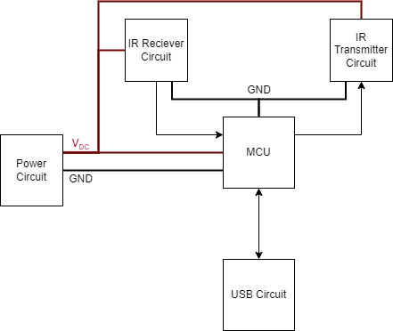

<!-- This is the folder where you save your schematic and pcb design with their related files.  -->

# Design

## Working Principle

> The ESP32 will be the brains of the entire system. The system, along with the microcontroller will be powered by a battery. The choice and configuration of the battery will be done according to the total power demand of the ESP32 as well as the rest of the components. 
> The IR LEDs and sensor will work in tandem as the IR reciever-transmitter system, which in turn will connected to the ESP32. Users will be able to control devices via the buttons, which will also be connected to the MCU.  
> To program the MCU, the USB-UART convertor will recieve signals from the USB connector and turn it into serial data for the ESP32. 

A general schematic of the system is shown below:

## Key Components

### 1. MCU
#### Requirements
- WiFi connectivity
- Good documentation and support
- Cost-effective
- Low power consumption
- X GPIO pins
- Sleep mode

#### Options
| Part | Pros | Cons | Pricing | Data Sheet|
|-----|------|------|---------|-----------|
|ESP-Wroom-32E-N16[^1]|<li>BT enabled<li>Larger memory capacity<li>Community support and documentation| <li>Higher power consumption<li>Larger PCB footprint|3.60€|[ESP-WROOM-32E datasheet](https://www.mouser.de/datasheet/2/891/esp32_wroom_32e_esp32_wroom_32ue_datasheet_en-1855879.pdf)|
|Texas Instruments CC3220SM2ARGKT[^2]|<li>Low consumption <li>Smaller PCB footprint|<li>No BT capability<li>Scarce documentation<li>Lower memory capacity|9.33€|[CC3220S datasheet](https://www.ti.com/lit/ds/symlink/cc3220r.pdf?HQS=dis-mous-null-mousermode-dsf-pf-null-wwe&ts=1667105625183&ref_url=https%253A%252F%252Fwww.ti.com%252Fgeneral%252Fdocs%252Fsuppproductinfo.tsp%253FdistId%253D26%2526gotoUrl%253Dhttps%253A%252F%252Fwww.ti.com%252Flit%252Fgpn%252Fcc3220r)| 

#### Selection
The ESP32 was chosen as the MCU for this project. The ESP32 is a low-cost, low-power system on a chip microcontroller with integrated Wi-Fi and dual-mode Bluetooth. 

It is a powerful, generic Wi-Fi+BT+BLE MCU module that targets a wide variety of applications, ranging from low-power sensor networks to the most demanding tasks, such as voice encoding, music streaming and MP3 decoding. The ESP32 is the successor to the popular ESP8266. The ESP32 is a perfect choice for this project as it has a built-in Wi-Fi and Bluetooth connectivity, which will be used to connect to the internet and control the devices. 

The ESP32 also has a large memory capacity, which will be used to store the code and data. The ESP32 also has a low power consumption, which will be useful for the battery-powered system. The ESP32 also has a large number of GPIO pins, which will be used to connect the IR LEDs and sensor. The ESP32 also has a sleep mode, which will be used to conserve power when the system is not in use.

### 2. IR Reciever
#### Requirements
- Frequency range: 36.7kHz-38kHz [^4]
- Electrostatic shield?
- Automatic gain control (AGC) circuit

#### Options
| Part | Pros | Cons | Pricing | Data Sheet|
|-----|------|------|---------|-----------|

#### Selection 
X was selected because

### 3. USB-UART Converter
#### Requirements
- Same voltage as MCU

#### Options
| Part | Pros | Cons | Pricing | Data Sheet|
|-----|------|------|---------|-----------|
|CP2102 [^8] |<li>Low power consumption<li>Smaller PCB footprint<li>|<li>Limited data transfer rates range<li>5V device, not same as the MCU of choice |[2,16 €](https://www.mouser.de/ProductDetail/Silicon-Labs/CP2102N-A02-GQFN24?qs=u16ybLDytRYKabtL%2FE7DZA%3D%3D)|[Datasheet](https://www.mouser.de/datasheet/2/368/cp2102n_datasheet-1634912.pdf)|
|FT232R [^9]|<li>Supports bus powered, self-powered and highpower bus powered USB configurations<li>3.3V device, same as the MCU|<li>Higher price|[4.80€](https://www.mouser.de/ProductDetail/FTDI/FT232RL-REEL?qs=D1%2FPMqvA103RC6OU6bKtoA%3D%3D)|[Datasheet](https://ftdichip.com/wp-content/uploads/2020/08/DS_FT232R.pdf)| 

#### Selection
The FT232R was chosen as the USB-UART converter for this project. The FT232R is a USB to serial UART interface with optional clock generator output. The FT232R is a perfect choice for this project as it is a 3.3V device, which is the same as the MCU. The FT232R also has a higher data transfer rate, which will be useful for the system.

## References
[1]: [ESP Comparison](https://gist.github.com/sekcompsci/2bf39e715d5fe47579fa184fa819f421)

[2]: [Low power Wifi MCU](https://hackaday.com/2018/12/17/a-deep-dive-into-low-power-wifi-microcontrollers/)

[3]: [Running Wifi Microcontrollers on Battery](https://blog.voneicken.com/projects/low-power-wifi-intro/)

[4]: [IR and RF remote controls](https://os.mbed.com/users/4180_1/notebook/ir-and-rf-remote-controls/#:~:text=Typically%20for%20IR%2C%20the%20frequency,most%20cases%20it%20works%20well.)

[5]: [Choosing an Infrared Receiver Based on AGC Type](https://www.vishay.com/docs/49860/0811wd_d.pdf)

[6]: [Infrared Receiver ICs ATA2525/ATA2526 for Use in IR Receiver Module Applications](http://ww1.microchip.com/downloads/en/DeviceDoc/Atmel-4895-Selection-Guide-ATA2525-ATA2526_Application-Note.pdf)

[7]: [IR Receivers - Vishay](https://www.mouser.com/pdfdocs/_ms6938.pdf)

[8]: [CP2102 Datasheet](https://www.silabs.com/documents/public/data-sheets/CP2102-9.pdf)

[9]: [FT232R USB UART IC Datasheet](https://ftdichip.com/wp-content/uploads/2020/08/DS_FT232R.pdf)