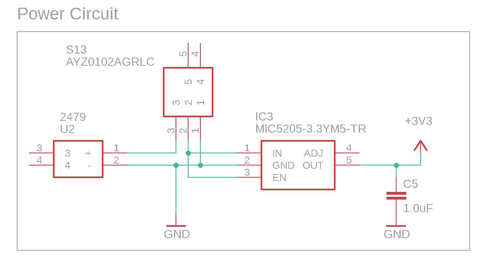
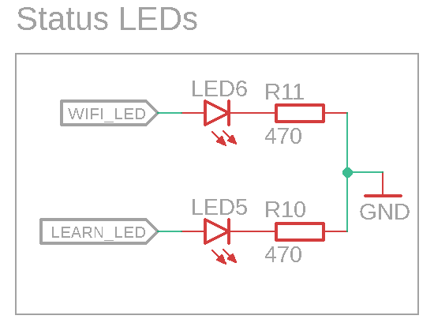
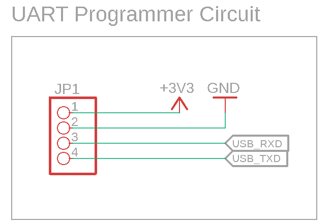
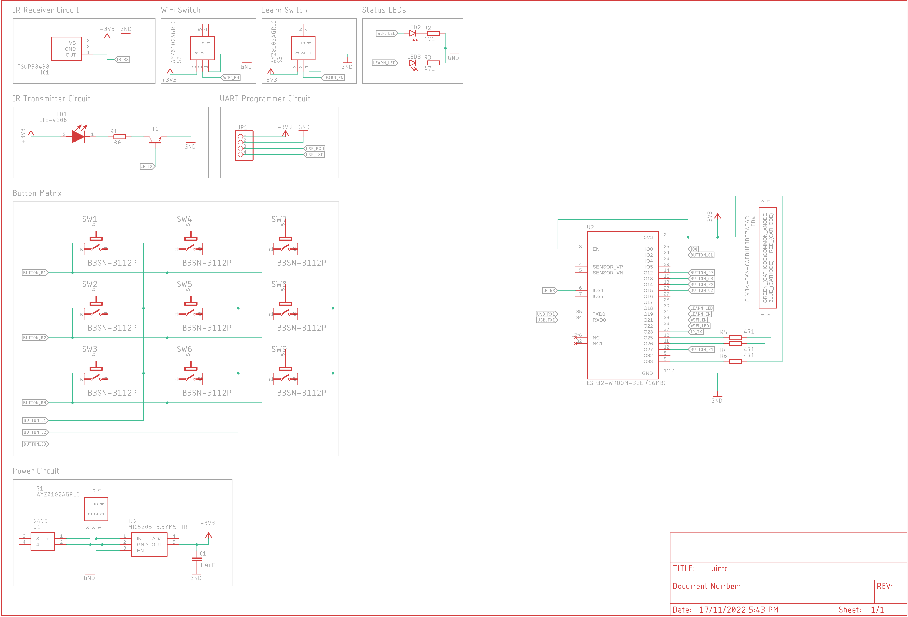
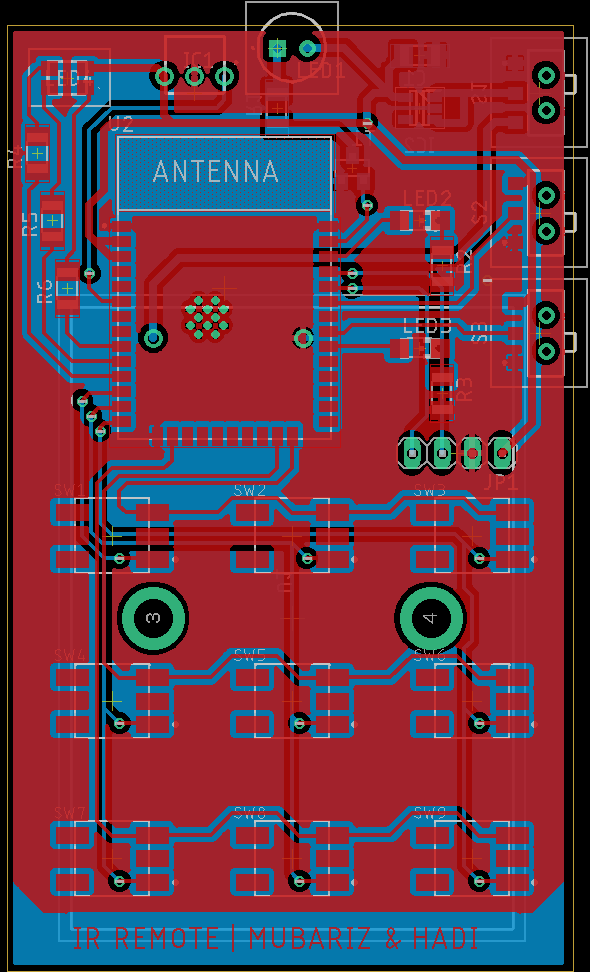
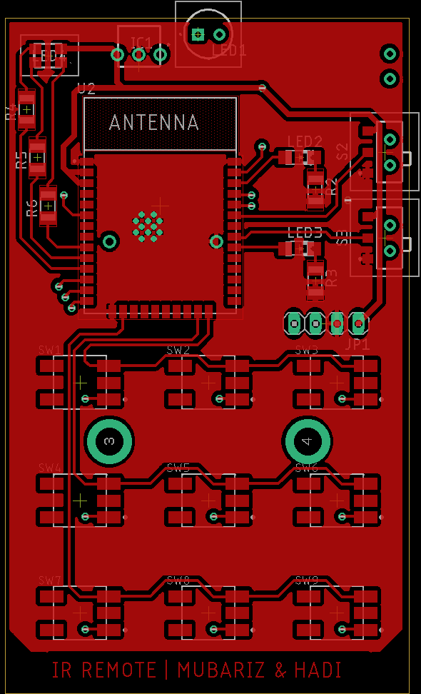
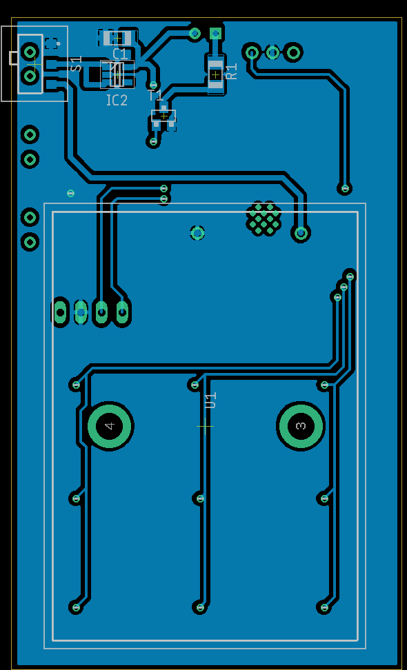
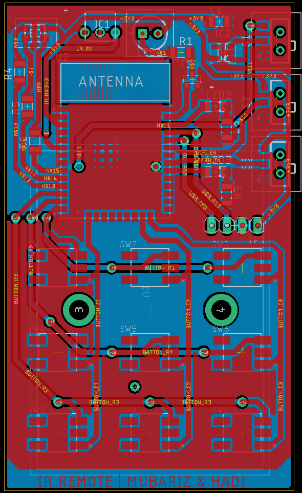
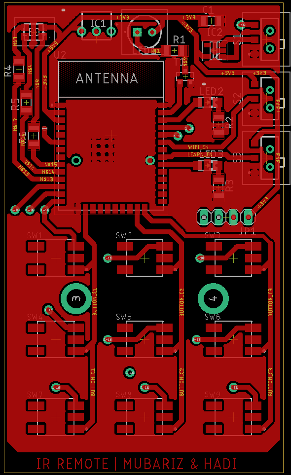
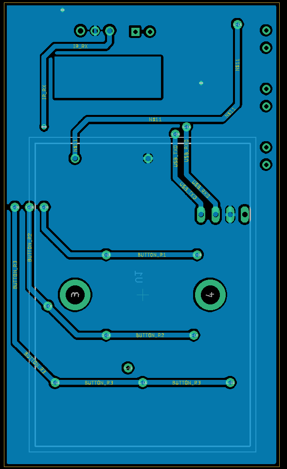

<!-- This is the folder where you save your schematic and pcb design with their related files.  -->

# Design

## Working Principle

> The ESP32 will be the brains of the entire system. The system, along with the microcontroller will be powered by a battery. The choice and configuration of the battery will be done according to the total power demand of the ESP32 as well as the rest of the components. 
>
>The IR LEDs and sensor will work in tandem as the IR reciever-transmitter system, which in turn will connected to the ESP32. Users will be able to control devices via the buttons, which will also be connected to the MCU.  
>
> To program the MCU, the USB-UART convertor will recieve signals from the USB connector and turn it into serial data for the ESP32. 

A general schematic of the system is shown below:

## Key Components

### 1. MCU
#### Requirements
- WiFi connectivity
- Good documentation and support
- Cost-effective
- Low power consumption
- X GPIO pins
- Sleep mode

#### Options
| Part | Pros | Cons | Pricing | Data Sheet|
|-----|------|------|---------|-----------|
|ESP-Wroom-32E-N16[^1]|<ul><li>BT enabled<li>Larger memory capacity<li>Community support and documentation</ul>| <ul><li>Higher power consumption<li>Larger PCB footprint</ul>|[3.60€][ESP-WROOM-32E Price]|[ESP-WROOM-32E datasheet]|
|Texas Instruments CC3220SM2ARGKT|<ul><li>Low consumption <li>Smaller PCB footprint</ul>|<ul><li>No BT capability<li>Scarce documentation<li>Lower memory capacity</ul>|[9.33€][CC3220S Price]|[CC3220S datasheet]| 

#### Selection
The ESP32 was chosen as the MCU for this project. The ESP32 is a low-cost, low-power system on a chip microcontroller with integrated Wi-Fi and dual-mode Bluetooth. 

It is a powerful, generic Wi-Fi+BT+BLE MCU module that targets a wide variety of applications, ranging from low-power sensor networks to the most demanding tasks, such as voice encoding, music streaming and MP3 decoding. The ESP32 is the successor to the popular ESP8266. The ESP32 is a perfect choice for this project as it has a built-in Wi-Fi and Bluetooth connectivity, which will be used to connect to the internet and control the devices. 

The ESP32 also has a large memory capacity, which will be used to store the code and data. The ESP32 also has a low power consumption, which will be useful for the battery-powered system. The ESP32 also has a large number of GPIO pins, which will be used to connect the IR LEDs and sensor. The ESP32 also has a sleep mode, which will be used to conserve power when the system is not in use.

### 2. IR Reciever
#### Requirements
- Frequency range: 36.7kHz-38kHz [^4]
- Electrostatic shield?
- Automatic gain control (AGC) circuit -AGC2 [^AGC2]

#### Options
| Part | Pros | Cons | Pricing | Data Sheet|
|-----|------|------|---------|-----------|
|TSMP77000|<ul><li>Wide range of frequencies 20 kHz to 60 kHz<li>Dedicated carrier out signal (modulated) for code learning <li>Improved shielding <li>Good documentation </ul> | <ul><li> Additional processing required to output signal </ul>|[1.65€][TSMP77000 Price] |[TSMP77000 Datasheet]|
|TSOP38438| <ul><li>Low supply current <li> Internal filter for required frequency 38Hz <li> Good documentation and widespread usage </ul> | <ul><li> Only 38Hz and adjacent frequencies </ul> | [1.16€][TSOP38438 Price]|[TSOP38438 Datasheet] |
|VS1838B|<ul> <li>Cheap </ul> |<ul><li>Poor documentation </ul> | [0.06€][VS1838B Price] | [VS1838B Datasheet]|

#### Selection 
TSOP38438 was selected because it is a well documented and widely used IR reciever. It also has a low supply current and an internal filter for the required frequency. 

The additional frequency range of the TSMP77000 was not required as the IR remote control will be controlling consumer electronics that use the 36.7kHz - 38kHz frequency. Also, the modulated carrier out signal provided by the TSMP77000 needs additional processing to store and output the IR code.

The VS1838B was not selected as it is cheap but has poor documentation.

### 3. IR LED/Transmitter
#### Requirements
- Frequency range: 36.7kHz-38kHz [^4]
- Low power consumption

#### Options
| Part | Pros | Cons | Pricing | Data Sheet|
|-----|------|------|---------|-----------|
|LTE-4208|<ul><li>Low power consumption <li>Good documentation </ul> | <ul><li>limited range of frequencies</ul>|[0.52€][LTE-4208 Price] |[LTE-4208 Datasheet]|
|TSAL6400| <ul><li>Wide range of frequencies 20 kHz to 60 kHz <li>Good documentation </ul> | <ul><li> Higher power consumption </ul> | [0.47€][TSAL6400 Price]|[TSAL6400 Datasheet]|

#### Selection
The LTE-4208 was selected as it has a low power consumption and good documentation. The TSAL6400 has a wide range of frequencies, but the range of frequencies for provided by the LTE-4208 are sufficient for the IR Reciever. 

The TSAL6400 wasn't selected as it also has a higher power consumption. 

### 4. USB-UART Converter module
#### Requirements
- Same voltage as MCU or have both 3.3V and 5V as options
- USB 2.0/microUSB port onboard
- Complete module, will be used off PCB (not part of BOM)

#### Selection
The CP2102 module was chosen as the USB-UART converter module. This module is needed to help program the MCU. The CP2102 is a USB to UART Bridge Controller with a Virtual COM Port interface. It is a complete module, and available at the labs, which means that it will be used off the PCB and hence won't be part of the BOM. The CP2102 also has a USB 2.0/microUSB port onboard. The CP2102 was chosen as it has been often used with the ESP32. The schematic for the connection to the module is shown at: [USB-UART Circuit](schematics/usb-uart.png)

## Power Circuitry
### Battery Selection
As most of the components in the system will be powered by the battery, the battery will be the most important component in the system. The chosen battery type for this project is a typical AAA battery. Each one provides 1.5V, and there will be 3 of these employed. This gives the MCU enough operating voltage, as well as to the rest of the system. But this will be stepped down using a voltage regulator. 

### Voltage Regulator
To help step down the 4.5V from the 3x AAA batteries, the [MIC5205-3.3YM5-TR][MIC5205-3.3YM5-TR LDO Datasheet] will be used. This is a LDO voltage step-down regulator. It will step the 4.5V down to 3.3V, which is the acceptable operating voltage for the ESP32.

## Schematics

### Power Circuitry
The power circuitry features 3 1.5V AAA Batteries, in a [pcb mounted holder][2479 AAA Battery Holder Price]. A [toggle switch][AYZ0102AGRLC Switch Price] is used switch the power supply on and off. The [MIC5205-3.3YM5-TR][MIC5205-3.3YM5-TR LDO Price] LDO voltage regulator is used to step-down the voltage to 3.3V. A 1.0µF output capacitor is used as described in the typical circuit provided in the [datasheet][MIC5205-3.3YM5-TR LDO Datasheet].

### IR Receiver Circuit
The IR reciver circuit is quite simple with the TSOP38438 pins connected to the 3.3V, GND and GPIO pins of the ESP32. The circuit is shown below:

The low-pass filter circuit for the input voltage shown in the [TSOP38438 Datasheet] was not included as we do not expect significant voltage ripple and our supply voltage is greater than 2.7V.

### IR Transmitter Circuit
The [LTE-4208 IR LED][LTE-4208 Datasheet]  is used in the transmitter circuit. It has a peak emission wavelength of 940nm, which is ideal for consumer electronics[^940NM]. A viewing angle of 20° means that we need three LEDs to get a good spread. Current limiting resistors of 100ohms are used to limit the current to about 20mA which is well below the continous forward current.  

A low-side switch is used to turn on the IR LEDs. A SOT-23 package transistor is used that meets the requirement of IC > 200mA ([CMPT3904E][CMPT3904E Datasheet]).  The low-side switch is controlled by the ESP32 GPIO pin.

The circuit is shown below:

### Toggle LED, Power LED

## USB-UART Circuit
The CP2102 USB-UART module will be used to program the ESP32. The schematic for the connection to the module is shown below:

### Button Matrix
The button matrix is used to read the button presses. The button matrix is a 3x3 matrix of buttons. The circuit is shown below:

Additinally, diodes can be used to isolate single button presses from multiple button presses.
### Main Schematic

## PCB Layout
The guidelines for the PCB layout are as follows:
- The PCB should be as small as possible
- Test your schematic and board design with ERC and DRC checks in EAGLE.
- Two via sizes available: 0.6 mm (drill 0.9 mm, pad 1.5 mm) and 1.0 mm (drill 1.5 mm, pad 2.5 mm).
- Group name should be in the copper layer, for the industrially manufactured PCBs it should be in the silkscreen (e.g. layer 25).
- As start 25 thou signal tracks, 50 thou power/gnd tracks (10-15 thou between pads - keep tracks thick – reducing size called “necking”)
- Solid polygon fill preferred

- Restric layers around smd components?

The PCB layout was first created using the autorouter:

As the result was not satisfactory, the layout was manually created. Traces of 25 thou (power) and 12 thou (signal) were used with vias of 23.622 mil. The final PCB layout is shown below:

Additional refinements were made to the PCB layout based on feedback from Mr. Kremer. The following changes were made:
- Track width increased to 0.8mm
- Via drill size increased to 0.9mm
- All SMD components moved to top layer due to manufacturing constraints
-

## References
- [Low power Wifi MCU](https://hackaday.com/2018/12/17/a-deep-dive-into-low-power-wifi-microcontrollers/)

- [Running Wifi Microcontrollers on Battery](https://blog.voneicken.com/projects/low-power-wifi-intro/)

- [Choosing an Infrared Receiver Based on AGC Type](https://www.vishay.com/docs/49860/0811wd_d.pdf)

- [Infrared Receiver ICs ATA2525/ATA2526 for Use in IR Receiver Module Applications](http://ww1.microchip.com/downloads/en/DeviceDoc/Atmel-4895-Selection-Guide-ATA2525-ATA2526_Application-Note.pdf)

- [IR Receivers - Vishay](https://www.mouser.com/pdfdocs/_ms6938.pdf)

- [ESP32 Pinout Guide](https://randomnerdtutorials.com/esp32-pinout-reference-gpios/)

- [Data Formats for IR Remote Control](https://www.vishay.com/docs/80071/dataform.pdf)

- [LiFePO4 BQ25171-Q1: Automotive, Standalone 800-mA Linear Battery Charger](https://www.ti.com/lit/ds/symlink/bq25171-q1.pdf?HQS=dis-mous-null-mousermode-dsf-pf-null-wwe&ts=1667331358610&ref_url=https%253A%252F%252Fwww.mouser.de%252F)

- [esp32-pico-kit-v4_schematic](https://dl.espressif.com/dl/schematics/esp32-pico-kit-v4_schematic.pdf)

- [Battery Protection and Power Circuitry](https://www.electronics-lab.com/lifepo4-charger-board-based-on-cn3058e/)

- [Matrix Keypads](https://www.embeddedrelated.com/showarticle/519.php)

- [Button Pad Hookup Guide](https://learn.sparkfun.com/tutorials/button-pad-hookup-guide/all)

## Footnotes
[^1]: [ESP Comparison](https://gist.github.com/sekcompsci/2bf39e715d5fe47579fa184fa819f421)

[^4]: [IR and RF remote controls](https://os.mbed.com/users/4180_1/notebook/ir-and-rf-remote-controls/#:~:text=Typically%20for%20IR%2C%20the%20frequency,most%20cases%20it%20works%20well.)

[^AGC2]: ["AGC2™ was developed for typical remote control
coding schemes with a reliable function in noisy environments"](https://www.vishay.com/docs/49860/0811wd_d.pdf)

[^940NM]: [Infrared Waves, NASA](https://science.nasa.gov/ems/07_infraredwaves#:~:text=LEFT%3A%20A%20typical%20television%20remote,to%20that%20wavelength%20of%20radiation)

[^ESP32POWER]: [ESP32 - Power Consumption by Power Modes](https://www.espressif.com/sites/default/files/documentation/esp32_datasheet_en.pdf#page=32)

[ESP-WROOM-32E Price]: https://www.mouser.de/ProductDetail/Espressif-Systems/ESP32-WROOM-32E-N16?qs=Li%252BoUPsLEnsC4cA%252BUYB2Bw%3D%3D
[ESP-WROOM-32E Datasheet]: https://www.mouser.de/datasheet/2/891/esp32_wroom_32e_esp32_wroom_32ue_datasheet_en-1855879.pdf

[CC3220S Price]: https://www.mouser.de/ProductDetail/Texas-Instruments/CC3220SM2ARGKT?qs=Mv7BduZupUjdsZg3%2FQIrGA%3D%3D
[CC3220S Datasheet]: https://www.ti.com/lit/ds/symlink/cc3220r.pdf?HQS=dis-mous-null-mousermode-dsf-pf-null-wwe&ts=1667105625183&ref_url=https%253A%252F%252Fwww.ti.com%252Fgeneral%252Fdocs%252Fsuppproductinfo.tsp%253FdistId%253D26%2526gotoUrl%253Dhttps%253A%252F%252Fwww.ti.com%252Flit%252Fgpn%252Fcc3220r

[TSMP77000 Price]:https://eu.mouser.com/ProductDetail/Vishay-Semiconductors/TSMP77000TT?qs=N%2FGwOzoYEADvNPxjOfUvfQ%3D%3D
[TSMP77000 Datasheet]: https://eu.mouser.com/datasheet/2/427/tsmp77000-1767133.pdf

[TSOP38438 Price]: https://eu.mouser.com/ProductDetail/Vishay-Semiconductors/TSOP38438?qs=fbkhFuCHoTaKUNuf%2Fea2zA%3D%3D
[TSOP38438 Datasheet]: https://eu.mouser.com/datasheet/2/427/tsop382-1145243.pdf

[VS1838B Price]: https://de.aliexpress.com/item/1005003194864725.html?spm=a2g0o.productlist.main.31.2bf3c0286xjH8g&algo_pvid=0763317b-9a37-4d71-b7fa-94616c7dab45&algo_exp_id=0763317b-9a37-4d71-b7fa-94616c7dab45-15&pdp_ext_f=%7B%22sku_id%22%3A%2212000024604334838%22%7D&pdp_npi=2%40dis%21EUR%210.66%210.66%21%21%211.82%21%21%402100b69816671508652412760d0725%2112000024604334838%21sea&curPageLogUid=w4zis35s1smo
[VS1838B Datasheet]: https://www.elecrow.com/download/Infrared%20receiver%20vs1838b.pdf

[CP2102 Price]: https://www.mouser.de/ProductDetail/Silicon-Labs/CP2102N-A02-GQFN24?qs=u16ybLDytRYKabtL%2FE7DZA%3D%3D
[CP2102 Datasheet]: https://www.mouser.de/datasheet/2/368/cp2102n_datasheet-1634912.pdf

[FT232R Price]: https://www.mouser.de/ProductDetail/FTDI/FT232RL-REEL?qs=D1%2FPMqvA103RC6OU6bKtoA%3D%3D
[FT232R Datasheet]: https://ftdichip.com/wp-content/uploads/2020/08/DS_FT232R.pdf

[LTE-4208 Price]: https://www.mouser.de/ProductDetail/Lite-On/LTE-4208?qs=YmyZEYq5wW8LrIKlCQ2NxQ%3D%3D
[LTE-4208 Datasheet]: https://www.mouser.de/datasheet/2/239/LTE-4208-1141639.pdf

[CMPT3904E Price]: https://www.mouser.de/ProductDetail/Central-Semiconductor/CMPT3904E-TR-PBFREE?qs=u16ybLDytRZdO89O3AipsA%3D%3D
[CMPT3904E Datasheet]: https://www.mouser.de/datasheet/2/68/CSEMS03188_1-2539213.pdf 

[ARGB1313HS-TR]: https://www.mouser.de/ProductDetail/Stanley-Electric/ARGB1313HS-TR?qs=byeeYqUIh0NONXvux5PuCw%3D%3D
[ARGB1313HS-TR Datasheet]: https://www.mouser.de/datasheet/2/917/downloaddatafile-1504942.pdf

[S8050 Price]: https://www.mouser.de/ProductDetail/Micro-Commercial-Components-MCC/MMSS8050-H-TP?qs=FaVZESsvgndwiDXxXq5g0g%3D%3D
[S8050 Datasheet]: https://www.mouser.de/datasheet/2/258/MMSS8050_SOT_23_-1626440.pdf

[CLP6C Price]: (https://www.mouser.de/ProductDetail/Cree-LED/CLP6C-FKB-CM1Q1H1BB7R3R3?qs=UHyCXFkX5ExeH808uCrzYg%3D%3D)
[CLP6C Datasheet]: (https://www.mouser.de/datasheet/2/723/Cree_07282021_CLP6CFKB-2498149.pdf)

[AYZ0102AGRLC Switch Price]:(https://www.mouser.de/ProductDetail/CK/AYZ0102AGRLC?qs=dJbzCyn%252BCFYWKwcWEToS6A%3D%3D)
[AYZ0102AGRLC Switch Datasheet]:(https://www.mouser.de/datasheet/2/240/ayz-3051064.pdf)

[2479 AAA Battery Holder Price]:(https://www.mouser.de/ProductDetail/Keystone-Electronics/2479?qs=Q3RoVmURDomBPD85HfXZoA%3D%3D)
[2479 AAA Battery Holder Datasheet]:(https://www.mouser.de/datasheet/2/215/2479-741518.pdf)

[MIC5205-3.3YM5-TR LDO Price]:(https://www.mouser.de/ProductDetail/Microchip-Technology-Atmel/MIC5205-3.3YM5-TR?qs=U6T8BxXiZAUfeWKvTx3acw%3D%3D)
[MIC5205-3.3YM5-TR LDO Datasheet]:(https://www.mouser.de/datasheet/2/268/MIC5205_150mA_Low_Noise_LDO_Regulator_DS20005785C-2933204.pdf)

[TSAL6400 Price]:(https://eu.mouser.com/ProductDetail/Vishay-Semiconductors/TSAL6400?qs=oSAwVt7aKTHCOCv1ythi7g%3D%3D)
[TSAL6400 Datasheet]:(https://eu.mouser.com/datasheet/2/427/tsal6400-1766599.pdf)